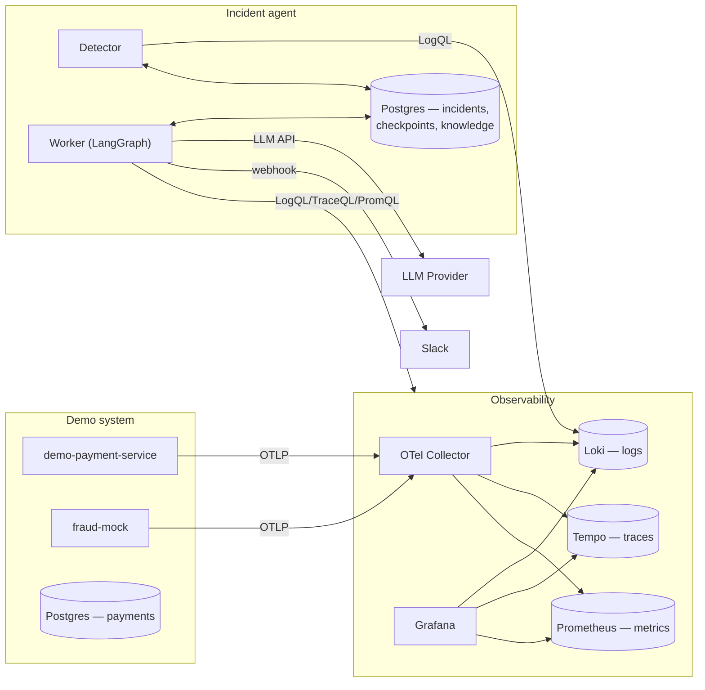

# Incident Triage Agent

A locally-running AI agent that detects production incidents, investigates them
with real evidence, and produces a cited root-cause analysis for a human to
review — before anything ever gets fixed or merged.

## What is it

incident-triage-agent watches a service's logs, traces, and metrics; groups
related errors into incidents; investigates each one using logs, distributed
traces, metrics, git history, and its own read-only exploration of the source
code; and writes up a structured explanation that cites the exact evidence it
used. The result is posted to Slack for a human to review. The agent never
merges code, never pushes to `main`, and never changes running infrastructure
— every output is a recommendation, not an action.

Everything runs on your own machine except three things: the LLM API, GitHub,
and Slack. Logs, traces, metrics, the agent's own state, and its knowledge
base all live in local containers and a local Postgres database.

## Why

The first step of every incident is always the same: find the error, find
the trace, find the recent commit, form a hypothesis. It's mostly manual
data-gathering across several tools, not hard thinking. This project
automates that gathering step, and only uses an LLM to interpret the
evidence and explain it — every claim it makes has to point at real evidence,
not just assert a cause.

## Key Features

- **Deterministic detection** — groups repeated errors and scores severity
  with no LLM, so it's fast, cheap, and consistent.
- **Evidence-based investigation** — pulls logs, trace latency, metrics, and
  git history automatically for every incident.
- **Code-reading agent loop** — the LLM can read files and search the
  codebase itself, within a budget, instead of guessing from a summary.
- **Cited, structured output** — the RCA is a validated schema, and every
  claim must point at a real piece of evidence.
- **Deterministic confidence scoring** — a computed score, not the LLM's own
  opinion, decides if an incident needs human review.
- **Durable investigations** — progress is saved to Postgres, so a crash
  resumes instead of starting over.
- **Growing knowledge base** — runbooks plus past incidents are searchable
  and help sharpen future investigations.
- **Known-answer evaluation harness** — real bug scenarios with known correct
  answers, so changes can be scored, not just eyeballed.

## Architecture Overview



Everything in the two left-hand boxes runs in Docker Compose on your own
machine. The agent itself (detector + worker) runs as local Python processes
against the same local Postgres. Only the LLM call and the Slack post leave
the machine.

## How It Works / Workflow

1. **Detect** — the detector polls Loki every 30s, normalizes error messages
   (strips UUIDs, numbers, timestamps), and hashes the result into a
   fingerprint. When one fingerprint crosses an occurrence threshold, an
   incident opens. No LLM in this step.
2. **Claim** — the worker claims an open incident using a Postgres advisory
   lock, so only one worker ever investigates a given incident at a time.
3. **Investigate** — a LangGraph state machine runs:
   ```
   load_context → classify → [collect logs / traces / metrics / git in parallel]
     → fuse evidence → code investigation (LLM, tool-calling, budgeted)
     → retrieve knowledge (RAG) → RCA (LLM, structured output, evidence-validated)
     → score confidence (deterministic) → route → notify
   ```
4. **Score** — a deterministic confidence score decides whether the RCA is
   trustworthy enough to alert on automatically, or needs a human to look
   first.
5. **Notify** — a templated Slack message is posted with the root cause, the
   recommended action, and links back to the evidence.
6. **Learn** — the resolved incident is written back into the knowledge base,
   so a similar bug next time retrieves this one as a precedent.

## Prerequisites

- Python 3.12+ and [`uv`](https://docs.astral.sh/uv/)
- Docker and Docker Compose
- An LLM API key (Anthropic, OpenAI, or an OpenAI-compatible gateway)
- A Slack incoming webhook (optional — the agent runs fine without one, it
  just won't post anywhere)

## Installation / Setup

```bash
git clone <this-repo>
cd incident-triage-agent
uv sync
cp .env.example .env   # fill in your LLM credentials and Slack webhook
docker compose up -d
```

The companion demo service (`demo-payment-service`) needs to be cloned as a
sibling directory — `config/services.yaml` points at `../demo-payment-service`.
A sample application set up for triage is available here:
[gautamamber/demo-payment-service-triage](https://github.com/gautamamber/demo-payment-service-triage).

## Configuration / Environment Variables

All configuration lives in `.env` (see `.env.example` for the full list) and
`config/*.yaml`.

| Variable | Purpose |
|---|---|
| `AGENT_MODE` | `observe` / `rca` / `fix` — gates how far the agent is allowed to act. Default `rca`: investigates and alerts, never attempts a fix. |
| `LLM_PROVIDER` | `anthropic`, `openai`, or `gateway` (an internal OpenAI-compatible endpoint) |
| `ANTHROPIC_API_KEY` / `OPENAI_API_KEY` / `LLM_GATEWAY_*` | Credentials for whichever provider is selected |
| `GITHUB_TOKEN`, `GITHUB_REPO` | Scoped to the target repo only — read/write on contents and PRs |
| `SLACK_WEBHOOK_URL` | Incoming webhook for incident alerts |
| `AGENT_DATABASE_URL` | Local Postgres connection string |
| `LOKI_URL`, `TEMPO_URL`, `PROMETHEUS_URL` | Local observability backends |

Policy thresholds (detection windows, severity cutoffs, confidence weights,
investigation budgets) live in `config/policies.yaml`, not in code.

## Quick Start

Run the full pipeline against a real, deliberately-injected bug:

```bash
./scripts/run_demo.sh
```

This injects a real bug as a git commit, generates traffic, waits for the
detector to open an incident, runs the full investigation, and prints the
result — reverting everything back to a clean state when it finishes, even on
failure.

## Usage / Examples

Inspect the evidence bundle for one incident without invoking any LLM:

```bash
uv run python -m app.debug evidence INC-0001
```

Investigate one specific incident:

```bash
uv run python -m app.worker INC-0001
```

Run the detector once (useful after generating your own traffic):

```bash
uv run python -c "
from app.db import SessionLocal, init_db
from app.detector.poller import poll_once
init_db()
db = SessionLocal()
poll_once(db, 'payment-service')
db.close()
"
```

Check that all three external credentials (LLM, GitHub, Slack) are configured
correctly, without printing the secrets themselves:

```bash
uv run python -m app.check_credentials
```

## Project Structure

```
app/
├── detector/          # fingerprinting, aggregation, severity, lifecycle
├── tools/              # Loki, Tempo, Prometheus, git, code-search wrappers
├── agents/
│   ├── nodes/           # one file per graph node
│   ├── prompts/          # system/user prompt builders
│   ├── state.py           # LangGraph state schema
│   └── graph.py            # the compiled investigation graph
├── models/              # Pydantic/SQLAlchemy models
├── security/             # redaction (Luhn-checked cards, tokens, emails)
├── services/             # service -> local repo path registry
├── knowledge.py          # keyword + hybrid (pgvector) retrieval
├── llm.py                 # provider factory (Anthropic / OpenAI / gateway)
├── worker.py               # claims an incident, runs the graph, persists results
└── debug.py                 # CLI: print an evidence bundle, no LLM involved
config/
├── policies.yaml          # thresholds and confidence weights
├── services.yaml           # service -> repo mapping
└── metrics.yaml             # confirmed Prometheus metric names
knowledge/
├── runbooks/               # hand-written
└── incidents/                # written back automatically after each investigation
eval/
├── scenarios/*.yaml          # known-answer scenario definitions
├── patches/                   # real git patches for code-based bug scenarios
├── traffic/                    # rate-limited traffic generators per scenario
└── run.py                       # the evaluation harness
infra/                     # OTel Collector, Loki, Tempo, Prometheus, Grafana configs
scripts/run_demo.sh         # one-command end-to-end walkthrough
```

## Development Setup

```bash
uv sync --all-groups
uv run pre-commit install
```

Lint and format:

```bash
uv run ruff check .
uv run ruff format .
```

## Testing

Unit tests:

```bash
uv run pytest
```

Full behavioral evaluation — replays real bug scenarios end to end against a
running stack and a real LLM, and scores the result:

```bash
uv run python -m eval.run              # all scenarios
uv run python -m eval.run --scenario S01   # one scenario
```

## Contributing

Issues and pull requests are welcome. Before submitting a change:

1. Run `uv run ruff check .` and `uv run pytest` — both must pass
2. If the change touches investigation logic (detector, evidence, RCA,
   confidence), run `uv run python -m eval.run` and make sure nothing
   regresses
3. Keep new tools/nodes consistent with the existing pattern: deterministic
   code computes facts, the LLM only interprets them
